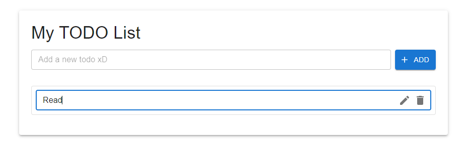

# Simple TODO List Application

A full-stack TODO list application built with React.js (frontend), Node.js/Express (backend), and MongoDB (database).

## Screenshots



## Features

- Create new TODO items
- List all TODO items
- Update existing TODO items
- Delete TODO items

## Tech Stack

- Frontend: React.js
- Backend: Node.js with Express
- Database: MongoDB
- Version Control: Git


## Installation & Setup

1. Clone the repository:
```bash
git clone https://github.com/ivyrgm/app-crud.git
cd app-crud
```

2. Install backend dependencies:
```bash
cd server
npm install
```

3. Install frontend dependencies:
```bash
cd ../client
npm install
```

4. Create a `.env` file in the server directory with your MongoDB connection string:
```
MONGODB_URI=your_mongodb_connection_string
PORT=5000
```

5. Start the backend server:
```bash
cd ../server
npm start
```

6. Start the frontend development server:
```bash
cd ../client
npm start
```

The application will be available at `http://localhost:3000`

## Git Commands Used

```bash
git init
git add .
git commit -m "message"
git push origin main
```

## Gitflow Workflow

1. Created main branch
2. Created develop branch from main
3. Created feature branches for each functionality:
   - feature/todo-crud
   - feature/styling
4. Merged feature branches into develop
5. Merged develop into main for release